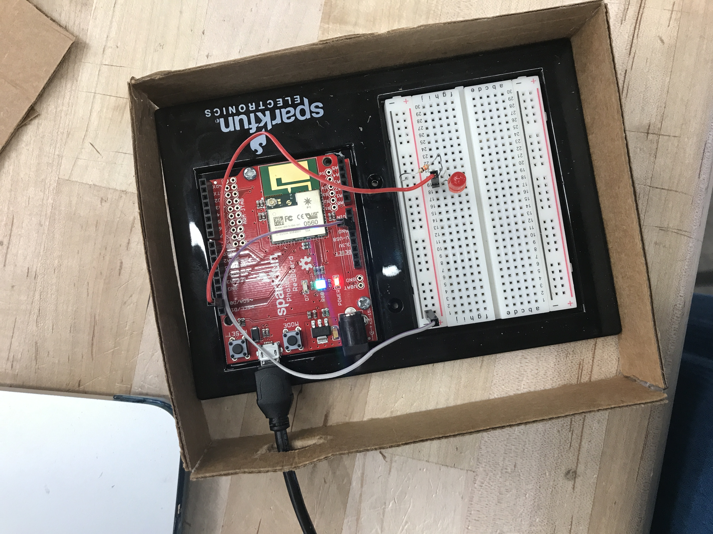

# Midterm IoT Project

Name:  Shreya Shankar

Date: October 10, 2017

## Project: Forget Me Not

### Conceptual Description

This project explores the relationship users have with technology through reducing the burden people have when attempting to remember their schedules. The premise of this project is simple, it is a LED light that turns on when an assignment is due on a day. The user needs statement is as follows: 

Shreya is a student who needs a way to keep up with her daily assignments 
because she values organization and structure.

This device will be used to take the burden of remembering crucial assignments off of a person's mind so that the user will be able to tell as soon as he or she wakes up whether or not there is a remaining assignment due that has not yet been complete. In order to use technology to enhance people's daily lives, our product will solve students' problem of having to remember a packed schedule and multiple assignments by giving them an easy outlet for their memory. However, this product is not meant to replace the already existing calendar framework - it is only meant to serve as a method of remembering to check the calender. 

### Form

My design enclosure is made to show only the LED light so it is easy for the user to tell when the light subscribes. 

**Finished Enclosure:**



**Electronics Exposed:**


### Technical Details
//   
Here you should give an overview of the technical operation of your device, including:
* A wiring diagram
* list of hardware used
* Explanation of your
* Link to code   

//

You can include code snippets here:

```
Particle.subscribe("Execute", messageParse, MY_DEVICES);
```

but also link to your project's full code in this repository:  [photon.ino](photon.ino)

**Wiring Diagram**


